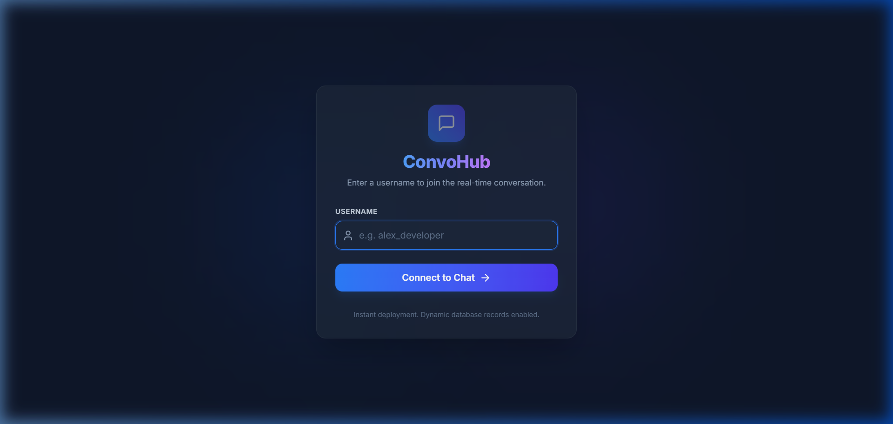
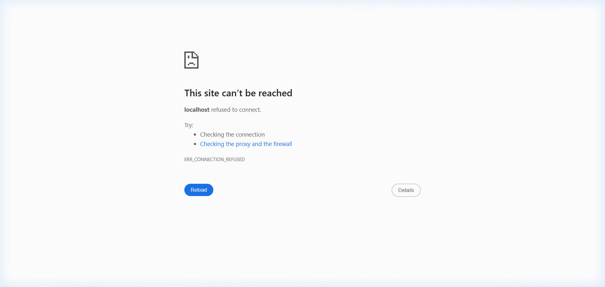
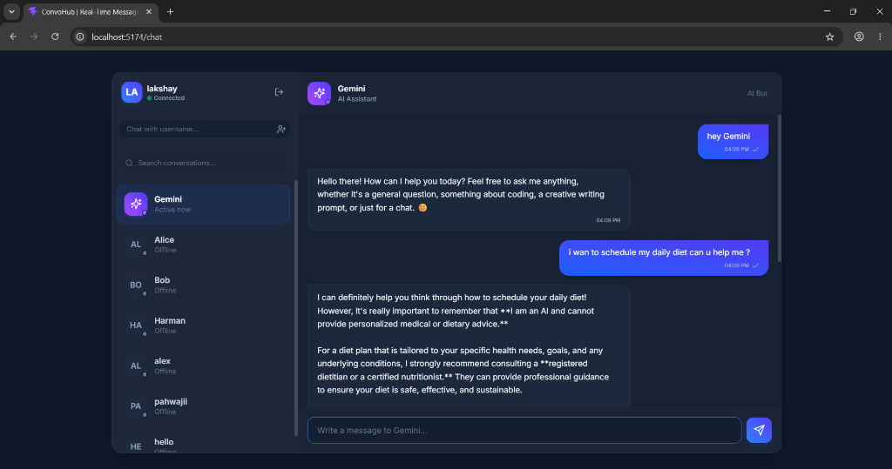

# ConvoHub | Real-Time Messaging Application

**Live Demo:** [https://web-chat-two-orpin.vercel.app](https://web-chat-two-orpin.vercel.app)

ConvoHub is a real-time web chat application featuring instant direct messaging, live typing indicators, online/offline user presence tracking, and message delivery/read receipts. 

It is built as a monorepo with an Express/Node.js backend (using Socket.io and Mongoose/MongoDB) and a React/Vite frontend (styled with Tailwind CSS and custom glassmorphism components).

---

## Screenshots

### Login Page


### Chat Dashboard


### Gemini AI Chatbot


---

## Features

### 🌟 Core Features
*   **Real-time Messaging:** Messages are sent and received instantly via WebSockets (`socket.io`).
*   **Stunning Modern UI:** Premium glassmorphism aesthetics, responsive layouts, tailored dark mode color palettes, custom gradients, and micro-animations.
*   **Persistent History:** All direct message histories are stored and fetched from a MongoDB database.
*   **Gemini AI Chatbot:** Talk to a dedicated AI assistant directly in the chat! Pinned at the top of your sidebar, styled with custom sparkle gradient avatars and pulsing active status indicators.

### 🚀 Bonus Features (Fully Implemented)
*   **Username-Based Login:** Simple dummy authentication. Users log in using only a unique username.
*   **Online/Offline User Status:** Interactive sidebar displaying the active/inactive status of all users with real-time indicators.
*   **Live Typing Indicator:** Shows when a chat partner is typing (including live typing dots when Gemini is thinking).
*   **Message Delivery & Read Receipts:** 
    *   **Single Check (`✓`):** Sent to the server, receiver is offline.
    *   **Double Gray Check (`✓✓`):** Delivered (receiver is online).
    *   **Double Blue Check (`✓✓`):** Message read by the receiver.

---

## 🤖 Gemini AI Bot Integration

ConvoHub features a built-in AI chatbot named **Gemini** whitelisted as a reserved user.

### Key Integration Highlights:
*   **Asynchronous WebSocket Processing**: Direct messages sent to `Gemini` are handled asynchronously by the backend socket listener. It immediately confirms the user's message and spawns a background thread to generate the bot's response, keeping the UI highly responsive.
*   **Live Typing Indicators**: While the Gemini API is processing the query, a live typing socket event is broadcasted so the user sees a bouncing typing indicator (`"Gemini is typing..."`).
*   **Alternating Message History**: The Gemini API requires conversation history to strictly alternate between `user` and `model` roles. Our integration merges consecutive messages sent by the same user and cleans the database records before generating the final prompt payload.
*   **Custom Persona**: Powered by `gemini-2.5-flash` with a tailored system instruction defining it as a polite, helpful, and creative developer assistant inside ConvoHub.
*   **Graceful API Key Handling**: If the `GEMINI_API_KEY` is missing in the backend `.env` file, the bot returns a friendly setup instructions card directly in the chat panel instead of crashing.

---

## Project Structure

```text
web_chat/
├── backend/               # Node.js + Express API & Socket.io server
│   ├── src/
│   │   ├── controllers/   # Message APIs
│   │   ├── models/        # Mongoose Schema (Message)
│   │   ├── routes/        # Express Routes
│   │   ├── services/      # Service integration layers (Gemini API)
│   │   ├── sockets/       # Socket.io connection & event handlers
│   │   ├── app.js         # Express app initialization
│   │   └── server.js      # Server entry point
│   ├── .env.example
│   └── package.json
│
├── frontend/              # React + Vite Client
│   ├── src/
│   │   ├── api/           # Axios client configurations
│   │   ├── context/       # ChatContext for WebSocket state & messaging handlers
│   │   ├── pages/         # Login and Chat dashboard pages
│   │   └── index.css      # Styling configurations & Tailwind directives
│   ├── index.html
│   └── package.json
└── README.md              # Project documentation (this file)
```

---

## Prerequisites

Before running the application, make sure you have:
*   [Node.js](https://nodejs.org/) (v16+ recommended)
*   [MongoDB](https://www.mongodb.com/) (Local instance running at `mongodb://127.0.0.1:27017` or a MongoDB Atlas URI)

---

## Environment Variables Required

### Backend (`backend/.env`)

Create a `.env` file in the `backend/` directory (or duplicate `backend/.env.example`):

```env
PORT=5000
MONGODB_URI=mongodb://127.0.0.1:27017/web_chat
CLIENT_URL=http://localhost:5174
GEMINI_API_KEY=your_gemini_api_key_here
GEMINI_MODEL=gemini-2.5-flash
```

*   `PORT`: The port the backend server listens on (default: `5000`).
*   `MONGODB_URI`: The MongoDB connection string.
*   `CLIENT_URL`: The origin of the frontend client (for CORS configuration, default: `http://localhost:5174`).
*   `GEMINI_API_KEY`: Your Gemini API Key from Google AI Studio.
*   `GEMINI_MODEL`: The Gemini API model to query (default: `gemini-2.5-flash`).

### Frontend

By default, the frontend is configured to connect to the backend at `http://localhost:5000` via [messageApi.js](file:///d:/my_coding_work/web_chat/frontend/src/api/messageApi.js) and [socketService.js](file:///d:/my_coding_work/web_chat/frontend/src/socket/socketService.js).

---

## Project Setup & Running

### 1. Backend Setup & Run

1.  Navigate to the `backend/` directory:
    ```bash
    cd backend
    ```
2.  Install dependencies:
    ```bash
    npm install
    ```
3.  Set up your environment variables inside a `.env` file (see [Environment Variables Required](#environment-variables-required)).
4.  Start the development server:
    ```bash
    npm run dev
    ```
    The server will start running at `http://localhost:5000`.

### 2. Frontend Setup & Run

1.  Navigate to the `frontend/` directory:
    ```bash
    cd frontend
    ```
2.  Install dependencies:
    ```bash
    npm install
    ```
3.  Start the development server:
    ```bash
    npm run dev
    ```
    The web app will start running locally, typically at `http://localhost:5173` (or `http://localhost:5174`). Open the URL in multiple browser windows or private/incognito tabs to test real-time chat between different users!

---

## Design Decisions

1.  **Monorepo Structure with Separated Concerns:** Keeping `backend` and `frontend` separate allows independent hosting, simple dependency trees, and clean service definitions.
2.  **Context-Driven React State:** A custom `ChatContext` wraps the application. This encapsulates all Socket.io listeners, state updates (typing, online status, messaging lists), and backend API queries in a clean, reusable interface, freeing the UI components from state complexity.
3.  **Dynamic Socket Room / Direct Addressing:** Socket.io events are mapped to unique users dynamically using a `userSocketMap`. Instead of relying on rigid, pre-defined chatrooms, direct messages are targeted using specific socket IDs mapped to registered usernames, allowing multi-device/multi-tab synchronization.
4.  **Tailored Glassmorphism & Custom Palettes:** Used Tailwind CSS combined with backdrop filters (`backdrop-blur-md`), dark backgrounds (`#0f172a`), and rich gradients (from blue to indigo) to give a modern, premium feel.
5.  **Strict Alternating Gemini Schema:** The Gemini API requires strict alternating roles between `user` and `model` (starting with `user`). Our backend service processes Mongoose message histories to merge sequential messages by the same sender, ensuring API request validity.
6.  **Node Native Fetch Integration:** Utilizing Node 22's global `fetch` avoids introducing external HTTP dependencies (like Axios or specific SDK wrappers) to compile the backend service, minimizing build footprints.

---

## Assumptions Made

1.  **Unique Usernames:** The login mechanism assumes username uniqueness is managed loosely. Since this is dummy authentication, registering with an existing username allows you to session-in as that user (useful for local testing and debugging).
2.  **Stateless Online Tracking:** Online users are determined by active Socket.io connections. When a user disconnects all their sockets (closes all tabs), they are immediately marked offline.
3.  **Unread Messages Count:** Unread counts are computed based on messages where `read: false` and the current user is the `receiver`. Upon selecting the conversation, the client emits a `messageRead` event to update the records in the database.
4.  **Local Storage Cache:** The logged-in username is stored in local storage to keep the session active upon refreshing.
